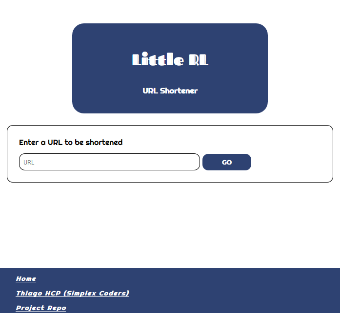
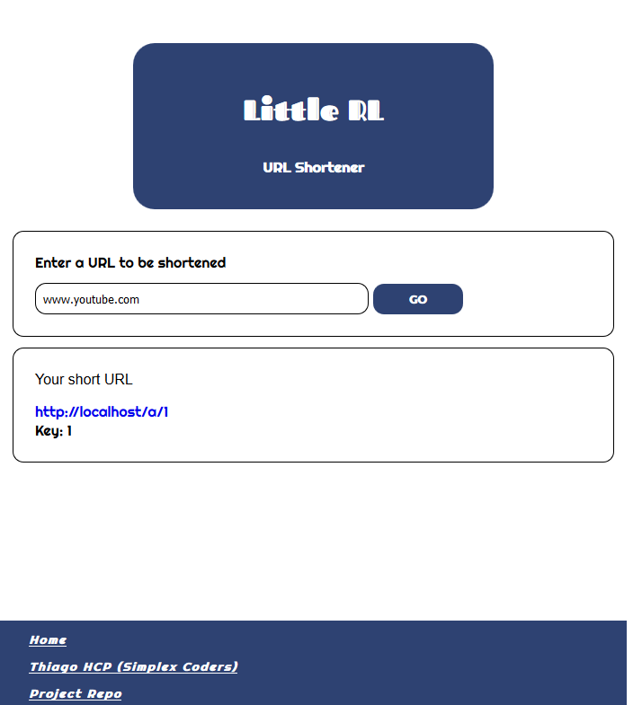
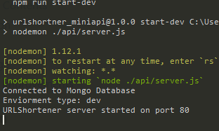
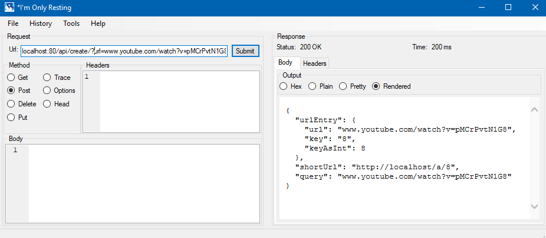

## Little Rl
**Little Resource Locator**  
A full stack ULR Shortening API and web application *(responsive)*, using Node Express and MongoDB as a backend, and a base36 number key system to represent urls.  
[Try it out here](https://littlerl.herokuapp.com/)

|   |   |
|---|---|
|||  

The API has 2 end points
- **Create**
- **Info**  

The end point for url redirection is **serverUrl/a/{unique base36 key}**.  
This is detailed more in the [API Usage Section](#usage).

You can try it out without instaling and setting up your own server at the fallowing url.
[https://littlerl.herokuapp.com/](https://littlerl.herokuapp.com/)  


### Table Of Contents
- [Intro](#little-rl)
- [Table Of Contents](#table-of-contents)
- [Instalation](#installation)
- [Usage](#usage)
- [API Usage](#api)
- [Possible Improvements](#possible-improvements)

### Installation
Clone the repo
> git clone https://github.com/DjDCH/----.git

Install dependencies
> npm install

### Usage
**mongoConfig.json**  
Create a file called **mongoConfig.json** in the **config** folder.  
Create a **config** folder in the base directory if one does not already exist.  
  
In **mongoConfig.json**, create a JSON object like the following and add your mongoDB uri. 
```
{
	"productionUri":"your production mongo database uri",
	"developmentUri":"your development mongo database uri",
	"testingUri":"mongodb uri used by the unit tests"	
}
```

I used [mlab cloud databases](https://mlab.com) for my mongodb databases.  
Also note, there is no problem using the same database uri for all 3, but the unit tests will quickly pollute the database.  

***

**build the front end**  
Webpack is used to bundle the front end JavaScript files. Run the following cmd to build the front end js.
> npm run build

***

**start the server**  
Run the following to start the server
> npm run start  

Run the following to start the server, and have it restart whenever a file is changed
> npm run start-dev



***

**acces the webpage**
Access the front end webpage by visiting the following url in your web browser
> localhost:{port server is on}/

### API
The backend API consists of 2 endpoints.
- **Create**
- **Info** 
***
**Create**  
- Is a POST request used to create a new shortened url.
- It's located at **apiUrl/api/create/?url=**
- It has a single query string parameter **?url=www.url-to-make-shorter.com**
- The url parameter must
	- Start with **www.**, **http://**, **https://**, or **ftp://**,
	- End with a valid top-level domain such as **.com** **.uk** **.gov** etc...

***

**Info**  
- Is a GET request used to get information on a previously shortened url
- It's located at **apiUrl/api/info/?key=**
- It has a single query string parameter **?key=1zq**
- The key query parameter is the base36 key of a url in the database

***
**Response**  
Both **Create** and **Info** return a json object like the following if the request was valid
```
{
 	"urlEntry": {
    	"url": "www.google.com/",
    	"key": "1",
    	"keyAsInt": 1
  	},
  	"shortUrl": "http://localhost/a/1",
  	"query": "www.google.com/"
}
```
- **urlEntry** contains information about the urls representation in the database.
	- **urlEntry.url** is the original url
	- **urlEntry.key** is the base36 number representing that url
	- **urlEntry.keyAsINt** is base36 key converted to base10
- **shortUrl** is the new shortened url. Visiting this in the browser should redirect to the original url.
- **query** is either the url query string or the key query string sent by the request
- If an **Info** request was sent and the no url was found with the supplied key parameter, **urlEntry** and **shortUrl** will be null.
- If a **Create** request was sent and the url to shorten has already been shortened/exists in the database, then already shortened url will be returned.
***

**Error**
If for any reason an error occurs, a json object like the following will be returned
```
{
 	"error": "Invalid query parameter",
 	"description": "The \"key\" query parameter is not a valid base36 number",
 	"query": "my-invalid-key"
}

```
***

**Visiting the shortened url**
> serverUrl/a/{key}

***



***
You can try it out without instaling and setting up your own server at the fallowing url.
[https://littlerl.herokuapp.com/](https://littlerl.herokuapp.com/)   

### Possible Improvements
- Change key system to base62. A 5 digit base36 number can represent upt to 60 million urls. Urls start to not be so short after 5-6 digit keys. A 5 digit base62 number can represent up to 900 million urls. A small improvement.
- The base36 key library used **(TinyKey.js)** does note perform safty checks for MAX_SAFE_INTEGER. Thus very large base36 keys may cause bugs or errors.
- Customization. Allow clients to specify their own key instead of using the default base36 keys.


